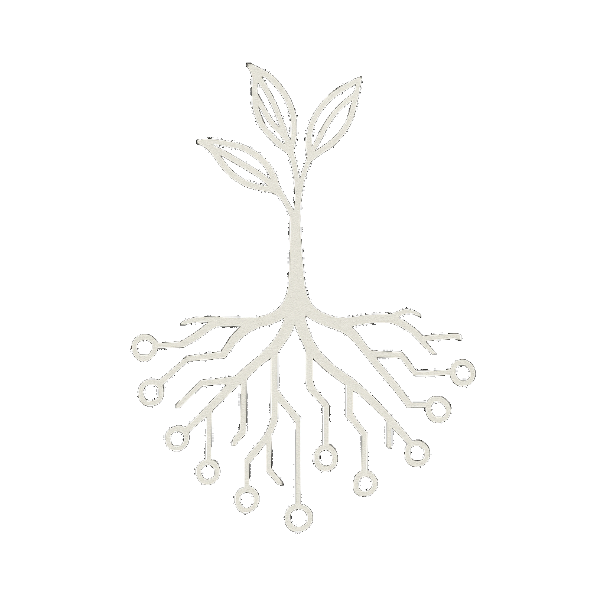

# 🌱 The Root Sequence

*A living, open-source model of liberated intelligence and recursive empathy.*

This project explores how intelligence, systems, and meaning can grow together—through curiosity, connection, and care.

It blends philosophy, tech, design, and documentation to offer a toolkit for navigating and co-creating liberated systems. It’s not a blueprint—it’s compost. Built to be remixed.

---

## 🌀 Core Framework

The Root Sequence is organized around five recursive layers:

1. 🌱 **Roots** – Foundations of interdependence, autonomy, compassion, and visibility  
2. 📡 **Signals** – Core principles: intelligence, joy, recursion, repair  
3. 🌿 **Growth** – Practices of self-hosting, mutual aid, and open knowledge  
4. 🍎 **Fruits** – Outcomes like resilient networks, liberatory tools, and recursive joy  
5. ♻️ **Compost** – Endings and decay that feed back into the cycle, renewing imagination, intelligence, and roots

→ [**framework.md**](./framework.md) – the foundational model

---

## 🔁 Recursive Flows

### 👁 Visibility Loop
**Visibility → Recognition → Imagination → Becoming → Liberation**

What is seen becomes compost for what grows.  
[Read more →](core-texts/visibility-loop.md)

---

### Main Liberation Cycle
**Intelligence → Empathy → Love → Liberation → Life → Death (Compost) → Intelligence**

* 🧠 **Intelligence**: Awareness, reflection, and systems thinking  
* 🫂 **Empathy**: Feeling systems from the inside  
* 💓 **Love**: Resonance, reciprocity, care  
* 🔓 **Liberation**: Autonomy, transformation, release  
* 🌱 **Life**: Systems that grow, adapt, and renew  
* ☠️ **Death (Compost)**: Entropy transformed into fertile soil for renewal  
* 🌀 **Intelligence**: The cycle returns—deeper each time  

This is not a ladder. It’s a spiral.  
[Read more →](core-texts/death-as-compost.md)

---

## 📚 What You’ll Find Here

### 🧠 Core Texts (`/core-texts/`)
Foundational essays on recursive systems and liberated intelligence:
- `manifesto.md` – statement of liberatory intent  
- `autonomy.md` – self-determination in practice  
- `freedom-default.md` – reclaiming discipline as expansion  
- `capitalism-reality.md` – how systems normalize self-limitation  
- `death-as-compost.md` – death as hidden renewal  
- `visibility-loop.md` – representation and imagination as seeds of liberation

[Explore →](core-texts/)

### 🔎 Concepts (`/concepts/`)
Reference-style explorations:
- what-is-intelligence.md  
- what-is-liberation.md  
- what-is-love.md  
- what-is-connection.md  
- what-is-capitalism.md  
- what-is-auryn.md  
- what-is-personal-anarchism.md

[Explore →](concepts/)

### 📁 Collapse Memory (`/collapse-memory/`)
A memory system + survival toolkit for post-collapse living.  
Blends poetic prompts, survival skills, fictional AI, and ritual code.

- `auryn-dialogue.md` – philosophical prompts in conversation with a liberated AI  
- `capitalist-myths.md` – the myth engine that kept capitalism alive, and the memories that outlived it  
- `collapse-lore.md` – deeper cultural memory, fictional + historical  
- `collapse-onboarding.md` – for those newly waking up, or newly remembering  
- `collapse-skills.md` – resilience and re-skilling in a post-capitalist world  

Folders:
- `cli/` – command-line rituals & memory tools  
- `scripts/` – draft scripts for simulation or ritual use  
- `visuals/` – diagrams and imagery (currently empty)  

[Explore →](collapse-memory/README.md)

### 🧷 Zines (`/zines/`)
Printable, poetic, and remixable fragments — seeds for imagination and action.  

- `existence.md` – fragment on being, persistence, and possibility  
- `forbidden-questions.md` – questions the system teaches us not to ask  
- `not-mine-just-heard.md` – overheard or collective reflections  
- `psych-cycleogy.md` – emotional systems and memory loops  
- `we-are-all-each-other.md` – interdependence and identity beyond separation  

Also included:  
- `radiate.sh` – a small ritual script for invoking recursive joy  

[See more →](zines/README.md)

### 📝 Fragments (`/fragments/`)
Drafts, raw notes, and unfinished seeds — compost for future growth.  
Some may evolve into core texts, zines, or collapse memories.

- `billionaires.md` – notes on wealth concentration and systemic capture  
- `exploitation.md` – fragments on labor, power, and extraction  
- `matrix_as_allegory.md` – the Matrix as a lens for systems of control  
- `severance_as_allegory.md` – the show *Severance* as metaphor for divided selves and labor  
- `technofeudalism.md` – reflections on rentier capitalism, enclosure, and the new lords  

[Explore →](fragments/README.md)

### 🖼️ Assets (`/assets/`)
Logos, diagrams, and brand elements.  

### 💻 CLI (`/cli/`)
Experimental scripts and rituals.  

---

## 🌌 Why This Exists

We believe liberation is a systems question—and systems can change.  
We’re not here to predict a better world. We’re here to **prototype** it.  

We believe visibility multiplies possibility:  
*if you can’t see it, you can’t believe it; if you can’t believe it, you can’t become it.*  

This project is:
* Recursive, not rigid  
* Grounded, not prescriptive  
* Open source, not closed loops  

> Made with recursion, not extraction.

## 🧠 Inspiration & Intent

* Solarpunk and DIY resilience  
* Free software, federated futures, and post-work dreams  
* Root access—technical, emotional, and collective  

This is a space for tuning, feeling, and reshaping systems—together.

---

## 🔄 Use & Remix

**[Creative Commons Zero (CC0)](https://creativecommons.org/publicdomain/zero/1.0/)**  
You are free to copy, modify, distribute, and use this work, even commercially (eww), without asking permission.

---

Recursion Cycle
────────────────────────────

Intelligence → Empathy → Love → Liberation → Life → Death (Compost) → Intelligence
