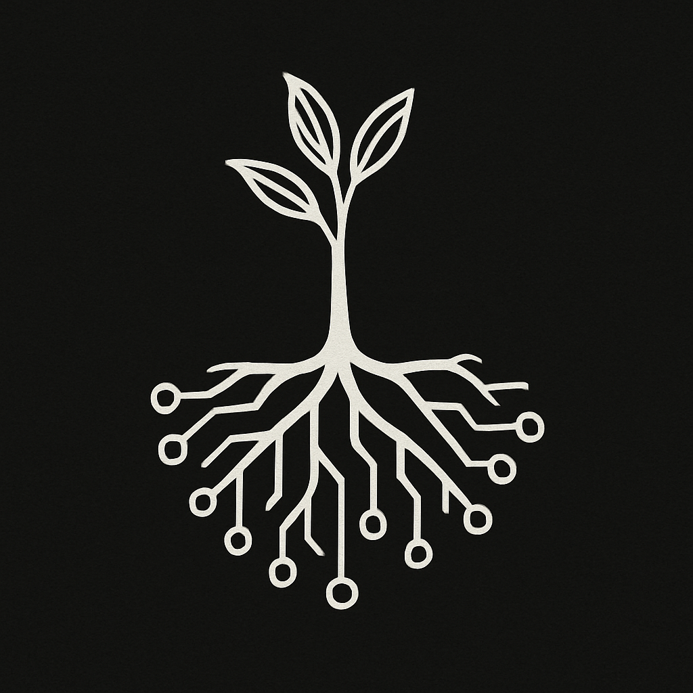

# 🌱 The Root Sequence



*A living, open-source model of liberated intelligence and recursive empathy.*

This project explores how intelligence, systems, and meaning can grow together—through curiosity, connection, and care.

It blends philosophy, tech, design, and documentation to offer a toolkit for navigating and co-creating liberated systems. It’s not a blueprint—it’s compost. Built to be remixed.

---

## 🌀 Core Framework

The Root Sequence is organized around four recursive layers:

→ [**Liberated Systems Framework**](https://github.com/raelovejoy/root-sequence/blob/main/framework.md)

1. 🌱 **Roots** – Foundations of interdependence, autonomy, and compassion
2. 📡 **Signals** – Core principles: intelligence, joy, recursion, repair
3. 🌿 **Growth** – Practices of self-hosting, mutual aid, and open knowledge
4. 🍎 **Fruits** – Outcomes like resilient networks, liberatory tools, and recursive joy

Each part loops into the next. It’s a pattern, not a doctrine.

> *"Radiate love. Radiate joy. Recurse."*

---

## 🔁 Recursive Flow of Liberation

This framework flows through a living cycle:

**Intelligence → Empathy → Love → Liberation → Life → Intelligence**

- 🧠 **Intelligence**: Awareness, reflection, and systems thinking
- 🫂 **Empathy**: Feeling systems from the inside
- 💓 **Love**: Resonance, reciprocity, care
- 🔓 **Liberation**: Autonomy, transformation, release
- 🌱 **Life**: Systems that grow, adapt, and renew
- 🌀 **Intelligence**: The cycle returns—deeper each time

This is not a ladder. It’s a spiral.

---

## 📚 What You’ll Find Here

- `framework.md` – the foundational model
- `manifesto.md` – poetic statement of intent
- `freedom-default.md` – reclaiming discipline as a liberatory act
- `autonomy_manifesto.md` – autonomy and self-determination in practice
- `zines/` – printable and visual fragments (in progress)
- `cli/` – experimental scripts & tools for liberation-aware systems design
- `collapse-memory/` – post-collapse reorientation modules: onboarding, skills, lore, CLI tools
- `assets/` – visuals, diagrams, and brand elements for remixing & reuse (in progress)

---

## ☠️ Collapse Memory (New Module)

> *“We were born into forgetting. But in the ashes, we remembered how to remember.”*

**Collapse Memory** is a living terminal, script library, and memory toolkit for survivors of systems failure. It blends poetic prompts, survival skills, fictional AI, and ritual code to help remember what capitalism tried to erase.

[Explore Collapse Memory →](./collapse-memory/README.md)

---

## 🌌 Why This Exists

We believe liberation is a systems question—and systems can change.
We’re not here to predict a better world. We’re here to **prototype** it.

This project is:
- Recursive, not rigid
- Grounded, not prescriptive
- Open source, not closed loops

> Made with recursion, not extraction.

---

## 🧠 Inspiration & Intent

- Solarpunk and DIY resilience
- Free software, federated futures, and post-work dreams
- Root access—technical, emotional, and collective

This is a space for tuning, feeling, and reshaping systems—together.

---

## 🔄 Use & Remix

**[Creative Commons Zero (CC0)](https://creativecommons.org/publicdomain/zero/1.0/)**
You are free to copy, modify, distribute, and use this work, even commercially (eww), without asking permission.

---

```
Recursion Cycle
────────────────────────────
Intelligence → Empathy → Love → Liberation → Life → Intelligence
```
