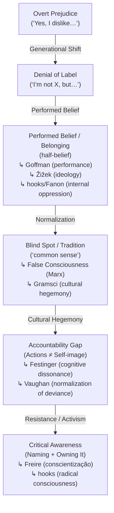

# The Denial Loop

## Overview

Oppression rarely disappears; it **mutates**. Overt prejudice shifts into denial of the label, then into **performed beliefs** (said/acted for belonging), which fuels normalization and blind spots. The result is an **accountability gap** between self-image and impact. This edition merges the original loop, the expanded “performed belief” layer, and the mapped related concepts in philosophy and social theory.

---

## Visual Map (ASCII with concepts)

```text
Overt Prejudice ("Yes, I dislike…")
        │
        ▼
Denial of Label ("I'm not X, but…")
        │
        ▼
Performed Belief / Belonging (half-belief)
   ↳ Goffman (Performance of Self)
   ↳ Žižek (Ideology as performance)
   ↳ Internalized Oppression (hooks, Freire, Fanon)
        │
        ▼
Blind Spot / "Tradition" (common sense)
   ↳ False Consciousness (Marx/Engels)
   ↳ Cultural Hegemony (Gramsci)
        │
        ▼
Accountability Gap (Actions ≠ Self-image)
   ↳ Cognitive Dissonance (Festinger)
   ↳ Normalization of Deviance (Vaughan)
        │
        ▼
Critical Awareness (Naming + Owning It)
   ↳ Freire (Conscientização)
   ↳ bell hooks (radical consciousness)
```

> This loop is recursive: it can reset, or spiral upward toward awareness and repair.

---

## Visual Map (Mermaid with concepts)



---

## Diagnostic Framework

1. **Denial of label** → evasive “I’m not X, but…” responses.
2. **Performed belief (half-belief / belonging)** → repeating talking points without conviction to maintain identity or safety.
3. **Normalization of harm** → framed as morality, tradition, or common sense and embedded in institutions.
4. **Accountability gap** → impact harms others while self-image remains “good/neutral.”
5. **Critical awareness** → naming contradictions; shifting norms; taking responsibility and repairing harm.

---

## Where This Shows Up (non-exhaustive)

* **Homophobia, Racism, Sexism, Transphobia, Ableism, Fatphobia**
* **Classism, Colonialism, Nationalism/Xenophobia**
* **Consumerism, Environmental destruction, Tech bias, Religious intolerance**

---

## Related Concepts

* **Gramsci — Cultural Hegemony**: domination via “common sense.”
* **Foucault — Power/Knowledge**: power hides in normalization.
* **bell hooks — Internalized Oppression**: replicating hierarchies from within.
* **Paulo Freire — Conscientização**: critical naming as liberation.
* **Stuart Hall — Representation**: language frames reality.
* **Erving Goffman — Performance of Self**: belief as social performance (fits the new layer).
* **Cognitive Dissonance (Festinger)** — inner contradiction between beliefs and actions. Tension between inner doubt and outer conformity. People resolve this tension through denial, excuse, or rationalization. The Denial Loop shows how this gets carried forward across generations. 
* **False Consciousness (Marx/Engels)** — misperceiving one’s social reality due to ideology. Aligns with half‑beliefs and normalization that mask systemic harm.
* **Cultural Hegemony (Gramsci)** — ruling ideas become “common sense.” Mirrors the Blind Spot/Tradition stage.
* **Internalized Oppression (hooks, Freire, Fanon)** — reproducing harmful hierarchies for belonging. Connects to performed belief.
* **Performance of Self (Goffman, Žižek)** — acting out beliefs one doesn’t hold, but sustaining the system. Žižek: *“They know very well what they are doing, but still, they are doing it.”*
* **Normalization of Deviance (Vaughan)** — harmful actions become normalized over time. Reflects the move from performance to blind spot.

---

## Zine / Poster Fragments

* **“Denial is the camouflage of prejudice.”**
* **“Prejudice doesn’t need conviction, only repetition.”**
* **“Many don’t believe what they believe — but belief performed still harms.”**
* **“Every generation inherits bias, then renames it.”**
* **“If you can’t say yes or no, the answer is already showing.”**
* **“Liberation begins by naming the gap between self-image and action.”**

---

## Link Snippets (for README / index)

* **Tagline:** *The Denial Loop — how prejudice mutates via denial, performance, and normalization.*
* **README line:** `🌀 [The Denial Loop](commons/denial-loop.md) — how prejudice mutates across generations through denial, performed belief, and blind spots.`

*Powered by love, not instruction.*
