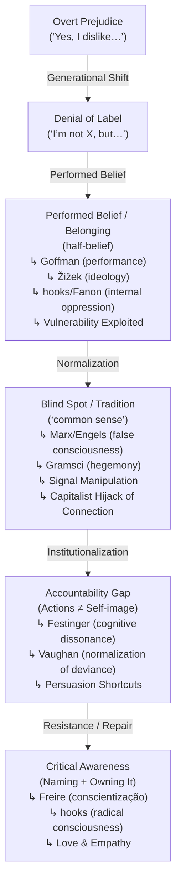

 # The Denial Loop

## Overview

Oppression rarely disappears; it **mutates**. Overt prejudice shifts into denial of the label, then into **performed beliefs** (said/acted for belonging), which fuels normalization and blind spots. The result is an **accountability gap** between self-image and impact.

---

## Visual Map (ASCII with concepts)

```text
Overt Prejudice ("Yes, I dislike…")
        │
        ▼
Denial of Label ("I'm not X, but…")
        │
        ▼
Performed Belief / Belonging (half-belief)
   ↳ Goffman (Performance of Self)
   ↳ Žižek (Ideology as performance)
   ↳ Internalized Oppression (hooks, Freire, Fanon)
   ↳ Vulnerability Exploitation (connection weaponized)
        │
        ▼
Blind Spot / "Tradition" (common sense)
   ↳ False Consciousness (Marx/Engels)
   ↳ Cultural Hegemony (Gramsci)
   ↳ Signal Manipulation (manufactured consent)
   ↳ Capitalist Connection Hijack (love → options, compassion → power)
        │
        ▼
Accountability Gap (Actions ≠ Self-image)
   ↳ Cognitive Dissonance (Festinger)
   ↳ Normalization of Deviance (Vaughan)
   ↳ Persuasion Shortcuts (Cialdini)
        │
        ▼
Critical Awareness (Naming + Owning It)
   ↳ Freire (Conscientização)
   ↳ bell hooks (radical consciousness)
   ↳ Empathy, Love, & Repair
```

> This loop is recursive: it can reset into harm, spiral deeper into manipulation, or spiral upward toward awareness and repair.

---

## Visual Map (Mermaid with concepts)



---

## Diagnostic Framework

1. **Denial of label** → evasive “I’m not X, but…” responses.
2. **Performed belief (half-belief / belonging)** → repeating talking points without conviction to maintain safety or status.
3. **Normalization of harm** → framed as tradition, morality, or “common sense”; reinforced by institutions and media.
4. **Capitalist hijack of connection** → love/compassion replaced with consumption, options, and power.
5. **Accountability gap** → harm continues while self-image remains “good/neutral.”
6. **Exploitation of vulnerability** → need for connection manipulated into toxic belonging.
7. **Critical awareness** → naming contradictions; shifting norms; repairing harm.

---

## Where This Shows Up (non-exhaustive)

* **Homophobia, Racism, Sexism, Transphobia, Ableism, Fatphobia**
* **Classism, Colonialism, Nationalism/Xenophobia**
* **Consumerism, Environmental destruction, Tech bias, Religious intolerance**
* **Media manipulation, Disinformation, Manufactured consent**
* **Capitalist connection systems — social media, advertising, corporate belonging**

---

## Theory Connections

* **Gramsci — Cultural Hegemony**: domination via “common sense.”
* **Foucault — Power/Knowledge**: power hides in normalization.
* **bell hooks — Internalized Oppression**: replicating hierarchies from within.
* **Paulo Freire — Conscientização**: critical naming as liberation.
* **Stuart Hall — Representation**: language frames reality.
* **Erving Goffman — Performance of Self**: belief as social performance.
* **Žižek — Ideology as performance**: systems sustained by acted belief.
* **Cialdini — Persuasion Principles**: exploiting reciprocity, authority, scarcity, etc.
* **Herman & Chomsky — Manufactured Consent**: systemic manipulation of signals and belonging.
* **Festinger — Cognitive Dissonance**: inner contradiction between belief and action.
* **Angela McRobbie — Cultural “Post-feminism”**: commodified liberation as a form of control (ties into capitalist hijack).

---

## Related Concepts

* **Cognitive Dissonance (Festinger)** — inner contradiction between beliefs and actions.
* **False Consciousness (Marx/Engels)** — misperceiving one’s social reality due to ideology.
* **Cultural Hegemony (Gramsci)** — ruling ideas become “common sense.”
* **Internalized Oppression (hooks, Freire, Fanon)** — reproducing harmful hierarchies.
* **Performance of Self (Goffman, Žižek)** — acting out beliefs one doesn’t hold.
* **Normalization of Deviance (Vaughan)** — harmful actions normalized.
* **Persuasion Shortcuts (Cialdini)** — predictable vulnerabilities exploited.
* **Manufactured Consent (Herman & Chomsky)** — structural manipulation of belonging.
* **Capitalist Hijack of Connection** — compassion re-coded into consumer “options.”

---

## Zine / Poster Fragments

* **“Denial is the camouflage of prejudice.”**
* **“Prejudice doesn’t need conviction, only repetition.”**
* **“Many don’t believe what they believe — but belief performed still harms.”**
* **“Every generation inherits bias, then renames it.”**
* **“Belonging without consent is exploitation.”**
* **“If you can’t say yes or no, the answer is already showing.”**
* **“Liberation begins by naming the gap between self-image and action.”**
* **“Connection can liberate, or it can be weaponized.”**
* **“Capital sells us options and calls it love.”**

---

## Compassionate Reading

The Denial Loop is not just a diagnostic tool — it is an **empathetic lens**. To understand how prejudice mutates is to practice empathy and compassion:

* **Empathy**: *“I see how you got here.”*
* **Compassion**: *“I don’t excuse harm, but I understand the pressures.”*
* **Love**: *“I believe you can move toward awareness and repair.”*

This aligns with **bell hooks’ view of love as a political force**: love means clarity, accountability, and care. It does not erase responsibility, but it refuses to dehumanize. To map the loop is to invite people not just into critique, but into transformation.

> **“Accountability without compassion is punishment; compassion without accountability is denial. Love is the force that interrupts the loop — and rewrites connection as liberation, not manipulation.”**

---

## Link Snippets

* **Tagline:** *The Denial Loop — how prejudice mutates via denial, performance, normalization, and exploited vulnerability.*
* **README line:** `🌀 [The Denial Loop](commons/denial-loop.md) — how prejudice mutates across generations through denial, performed belief, vulnerability exploitation, and blind spots.`

*Powered by love, not instruction.*
