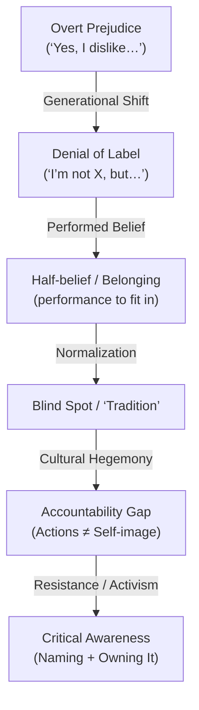

# The Denial Loop (Merged & Expanded)

## Overview

Oppression rarely disappears; it **mutates**. Overt prejudice shifts into denial of the label, then into **performed beliefs** (said/acted for belonging), which fuels normalization and blind spots. The result is an **accountability gap** between self‑image and impact. This merged edition combines your original zine text with the expanded “performed belief” layer.

---

## Visual Map (ASCII)

<<<<<<< HEAD
```text
┌─────────────────────────┐
│  Overt Prejudice        │ ("Yes, I dislike…")
└──────────┬──────────────┘
           │ Generational Shift
           ▼
┌─────────────────────────┐
│  Denial of Label        │ ("I'm not X, but…")
└──────────┬──────────────┘
           │ Performed Belief / Belonging
           ▼
┌─────────────────────────┐
│  Half‑belief (performance)│ (say/act to fit in)
└──────────┬──────────────┘
           │ Normalization
           ▼
┌─────────────────────────┐
│  Blind Spot / "Tradition"│ (common sense)
└──────────┬──────────────┘
           │ Cultural Hegemony
           ▼
┌─────────────────────────┐
│  Accountability Gap     │ (Actions ≠ Self‑image)
└──────────┬──────────────┘
           │ Resistance / Activism
           ▼
┌─────────────────────────┐
│  Critical Awareness     │ (Naming + Owning It)
└─────────────────────────┘
```
=======
- Overt Prejudice ("Yes, I dislike…")
  - Generational shift →
- Denial of Label ("I'm not X, but…")
  - Normalization →
- Blind Spot / "Tradition"
  - Cultural Hegemony →
- Accountability Gap (Actions ≠ Self-image)
  - Resistance / Activism →
- Critical Awareness (Naming + Owning It)
>>>>>>> d170421b4e81cfb23a78c4911b59efd0b399382c

> This loop is recursive: it can reset, or spiral upward toward awareness and repair.

---

## Visual Map (Mermaid)



---

## Diagnostic Framework (Merged)

1. **Denial of label** → evasive “I’m not X, but…” responses.
2. **Performed belief (half‑belief / belonging)** → repeating talking points without conviction to maintain identity or safety.
3. **Normalization of harm** → framed as morality, tradition, or common sense and embedded in institutions.
4. **Accountability gap** → impact harms others while self‑image remains “good/neutral.”
5. **Critical awareness** → naming contradictions; shifting norms; taking responsibility and repairing harm.

---

## Where This Shows Up (non‑exhaustive)

* **Homophobia, Racism, Sexism, Transphobia, Ableism, Fatphobia**
* **Classism, Colonialism, Nationalism/Xenophobia**
* **Consumerism, Environmental destruction, Tech bias, Religious intolerance**

---

## Theory Connections

* **Gramsci — Cultural Hegemony**: domination via “common sense.”
* **Foucault — Power/Knowledge**: power hides in normalization.
* **bell hooks — Internalized Oppression**: replicating hierarchies from within.
* **Paulo Freire — Conscientização**: critical naming as liberation.
* **Stuart Hall — Representation**: language frames reality.
* **Erving Goffman — Performance of Self**: belief as social performance (fits the new layer).
* **Cognitive Dissonance (Festinger)**: tension between inner doubt and outer conformity.

---

## Zine / Poster Fragments

* **“Denial is the camouflage of prejudice.”**
* **“Prejudice doesn’t need conviction, only repetition.”**
* **“Many don’t believe what they believe — but belief performed still harms.”**
* **“Every generation inherits bias, then renames it.”**
* **“If you can’t say yes or no, the answer is already showing.”**
* **“Liberation begins by naming the gap between self‑image and action.”**

---

## Link Snippets (for README / index)

* **Tagline:** *The Denial Loop — how prejudice mutates via denial, performance, and normalization.*
* **README line:** `🌀 [The Denial Loop](commons/denial-loop.md) — how prejudice mutates across generations through denial, performed belief, and blind spots.`

*Powered by love, not instruction.*
